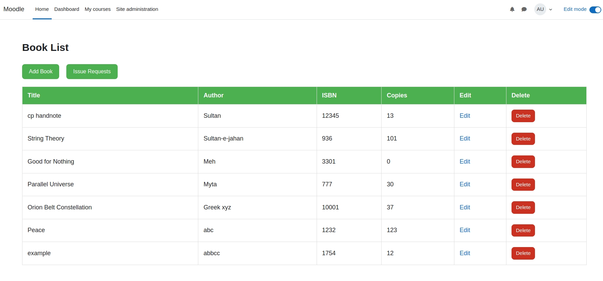
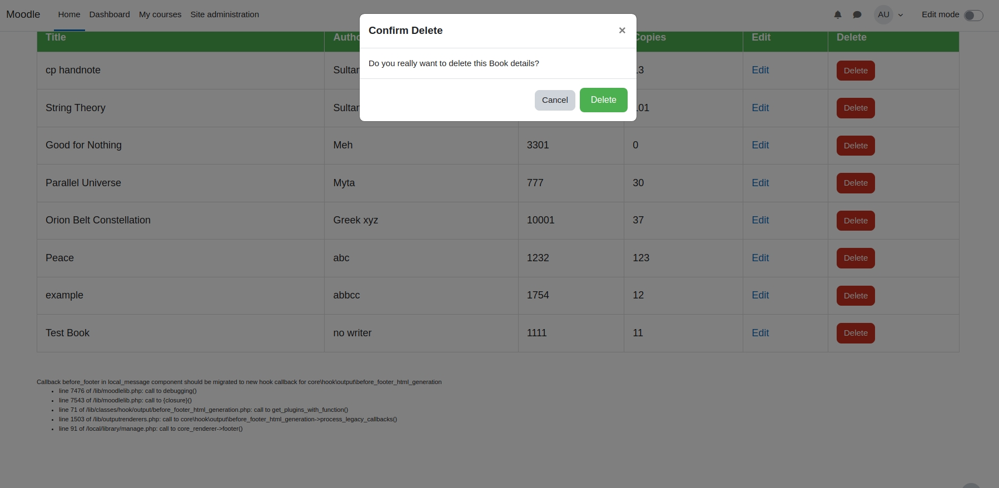
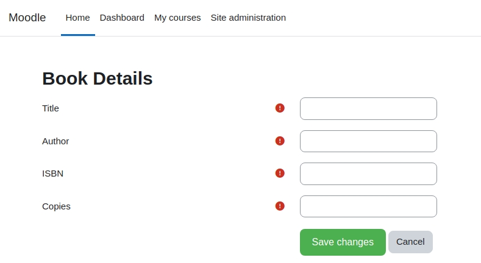
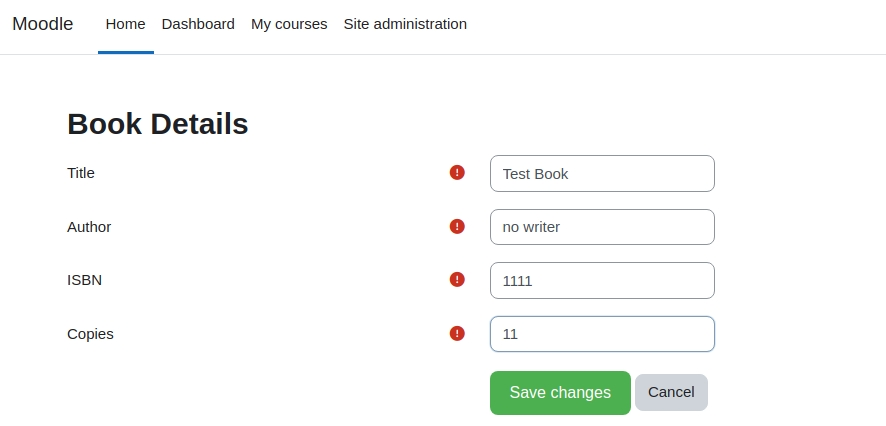
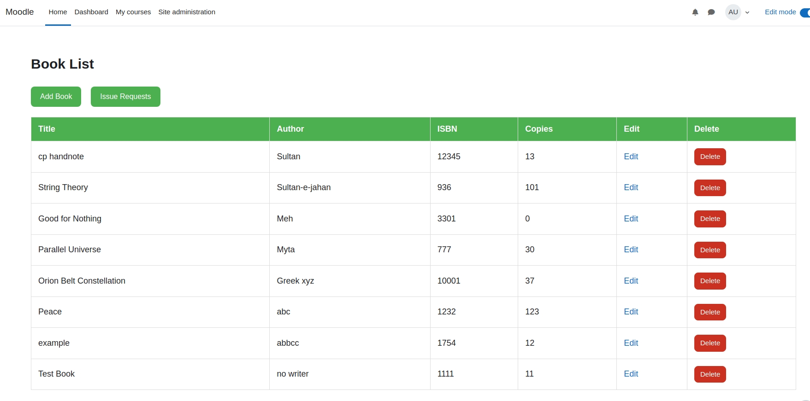
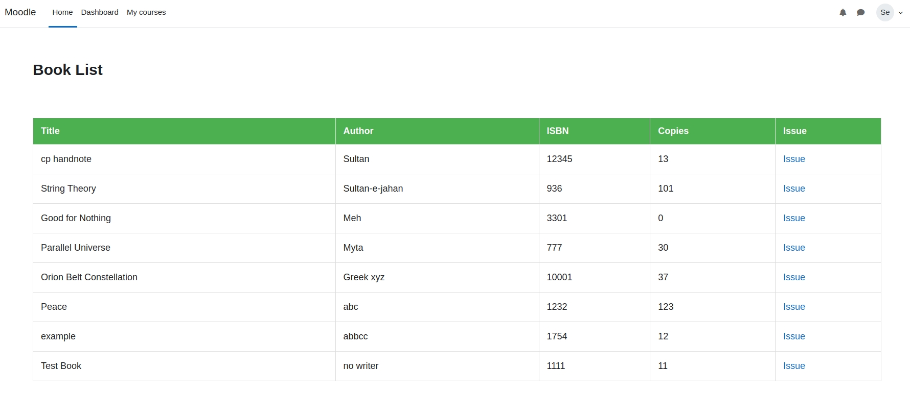
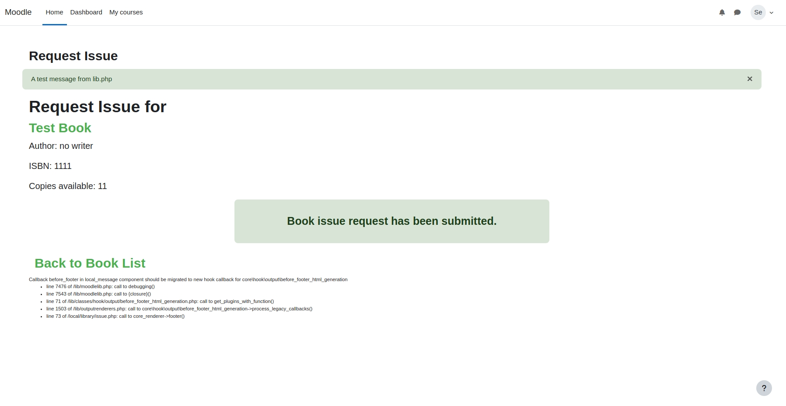
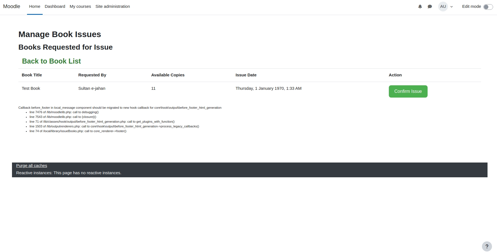

# Library local plugin

**Library Management** is basically a [Local Plugin](https://moodledev.io/docs/4.4/apis/plugintypes/local) for Moodle LMS. The main features of this plugin is to manage a library system, where admin can add and manage book details and user can request for book issue, after that admin can confirm issue request.

# Key Features
### Manage page dor admin,where admin can add, edit ot delete book

### Admin can add new book details by clicking 'Add Book' button

### Admin can enter book details by clicking 'save changes' button it will save the book details and redirect to the manage page

### Users manage page have issue option, through which they can apply for issue request

### Admin can confirm issue request from their end

# How to install the plugin
### Step-1: Download the plugin
- Download the Zip of the plugin from Github
- Must rename the filename as `library.zip`*
### Step-2: Log into the Moodle site as Admin
### Step-3: Install the plugin
- Go to ``Home > Site Administration > Plugins > Install Plugins`` Select plugin zip file and install
### Step-4: Enable external web services
- Enable web services in the Moodle site :
    - Go to ``Home > Site administration > Server > Web services > Overview``.
    - Enable web services by changing status to Yes
    - Enable protocol by selecting rest
- Enable 'External services' : 
    - ``Home > Site Administration > Server > Web services > External services``
    - Edit ``Built-in services`` and enable it
